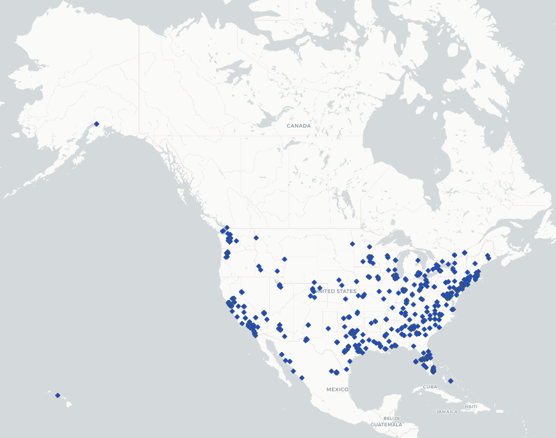

#  Map of Tweets in the United States with the Keyword "Inauguration"

My changes to the crawler was as follows:

`stream.filter(track=['inauguration'], is_async=True)`

I wanted to explore tweets with these keyword since the inauguration of Joe Biden and Kamala Harris occurred so recently, and I believed this would be a popular topic of conversation. I played around with changing the time limit for the crawler, but, as I expected, there were more than enough tweets after only 1 minute of searching. This event was recent and extremely important, so there was quite a bit of content. Therefore, I kept the time limit at 60 seconds.

Taking a look at the map, I see most tweets clustered in large metropolitan areas, specifically on the East Coast. This makes sense, considering the inauguration occurred in DC, and the lives of DC residents were decently disturbed that day and the days preceding. An almost complete city and road shutdown, as well as a large military presence most likely prompted many reactions, feelings, and conversations.

On the West Coast, we see clusters of tweets around big cities such as Seattle, San Francisco, and Los Angeles. This is probably due to the large population in those areas. Like several other major cities, they most likely also have a decent population of Democrats, or left-leaning residents, for whom the inauguration of Biden and Harris was momentous. This could also influence the number of tweets in those places.

The scarcity of tweets in the middle of the mainland, as well as Hawaii and Alaska, are most likely indicators of a smaller population.
